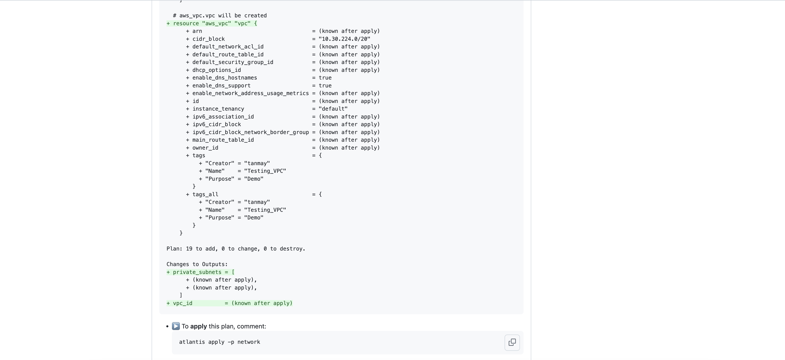
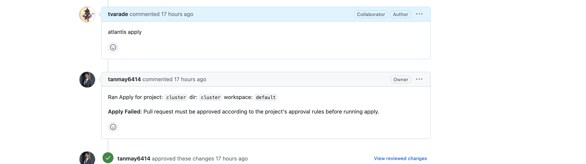
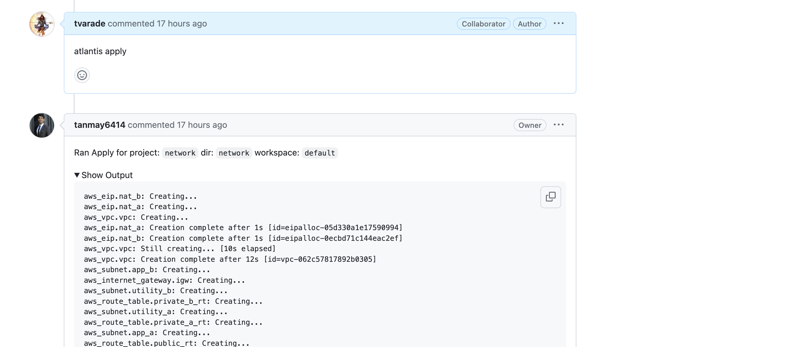

# Automated Deployment for Cluster
- We are using Terraform for provisioning our cluster, and it consist of different provider and their configuration, so for easy to deploy and consistency we need continuous deployment for or cluster code.
- We have different option like using Jenkins, Tekton but here I am using **Atlantis** for managing CI/CD process for our cluster.
- To use jenkins we need to add lots of configuration and apart from this anyone star
- Atlantis is a tool dedicately created for Terraform CI/CD process, and it don't need much configuration or maintenance.
- It deploy one statefulset in our cluster and using webhook github can communicated with Atlantis.
- It shows Terraform diff on Pull Request and we can create rules for merging of pull request, like all checks need to be pass, at least one approval from codeowner within Atlantis.
- If we  use jenkins we need to add lots of configuration and apart from this anyone can start pipeline with appropriate access, but for atlantis your PR needs to be approved by codeowner for actual deployment.

# Setting up atlantis

- Atlantis is deployed as helm chart in cluster. It has UI which show which PR is running although it is not required to have UI as all diff is rendered on PR, you can disable it.
- Below configuration required for atlantis

```
# Replace this with your own repo whitelist:
orgWhitelist: github.com/tanmay6414/*
orgAllowlist: github.com/tanmay6414/*
# logLevel: "debug"
# If using GitHub, specify like the following:
github:
  user: tanmay6414
  token: <token>
  secret: <secret text for webhook>
image:
  pullPolicy: IfNotPresent
repoConfig: |
  ---
  repos:
  - id: /.*/
    apply_requirements: [approved, mergeable]
    delete_source_branch_on_merge: false
    allowed_overrides: [apply_requirements, workflow, delete_source_branch_on_merge]
    allow_custom_workflows: true

service:
  type: ClusterIP
  port: 80
environment:
  AWS_ACCESS_KEY_ID: <access key>
  AWS_SECRET_ACCESS_KEY: <secret key>
```

- After atlantis started on cluster, for configuring you github repository you need to add [atlantis.yaml](atlantis.yaml). Inside this file you can customize you CD workflow.

# Working
- As mentioned earlier Atlantis render diff on the github PR. You can find this [sample PR](https://github.com/tanmay6414/openinnovationai/pull/1)
- You specify different project in your atlantis.yaml file and also planning strategy. If you want auto-plan whenever someone creates PR you can mentioned it as below in your atlantis configuration file
```
projects:
- name: network
  dir: .cluster-setup/network/
  autoplan:
    enabled: true
```
- If not, you can run a plan by commenting on Github PR with project name 
```
atlantis plan -p network
```

- If Pull request is not approved or plan is not successful it won't allow you to apply. [Sample](https://github.com/tanmay6414/openinnovationai/pull/2)

- If everything works out then after commenting **atlantis apply -p projectName** it will start applying terraform changes and if applied successfully merge the PR as well.
- If apply failed PR will not get merges


- [Main Page](/README.md)
- **Process explanation**
  - [Creating Cluster and its required resources](/ClusterSetup.md)
  - [Explaining CD process for Cluster](/ClusterDeploymentCD.md)
  - [Explaining CD process for Application](/AppDeploymentCD.md)
  - [Explain monitoring and alerting process](/Monitoring.md)
  - [Integration of Vault](/VAULT.md)