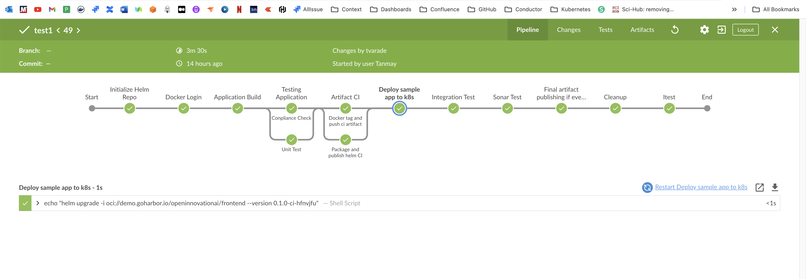

# Open Innovation Assignment
- ## Quick Links
  - [Open Innovation Assignment](#problem-statement) 
  - [Proposed Solution](#proposed-solution) 
  - [frontend-backend-database Application Structure](#frontend-backend-database-application-structure) 
  - **Process Workflow**
    - [Infrastructure CI/CD Process](#infrastructure-cicd-process) 
    - [Application CI/CD Process](#application-cicd-process) 
    - [Monitoring Process](#monitoring-process) 
    - [How to achieve HA](#how-to-achieve-ha) 
  - **Process explanation**
    - [Release process](#release-process) 
    - [Creating Cluster and its required resources](/ClusterSetup.md) 
    - [Explaining CD process for Cluster](/ClusterDeploymentCD.md) 
    - [Explaining CD process for Application](/AppDeploymentCD.md) 
    - [Explain monitoring and alerting process](/Monitoring.md) 

### Problem Statement
You are tasked to implement a platform to support a microservices architecture composed of a backend service, frontend service and PostgreSQL database with the
following requirements
- Automated Deployment
- Fault Tolerant / Highly Available
- Secure
- Autoscaling

# Proposed Solution
- **SCM -**  Github
- **Infrastructure Platform -** 
  - I will used **AWS public cloud** for provisioning all my workloads.
  - AWS works on pay per use
- **Orchestration Platform -** 
  - I will used AWS **EKS Kubernetes** for orchestration.
  - Kubernetes have lots of advantages over other platform such as scalability, scheduling ease, easy administration, self healing, fault tolerent and kubernertes is highly available along with good community support.
- **Containerization Platform -** 
  - I will used **Docker** for containerization.
  - Kubernetes is a  orchestration platform for containers 
- **Infrastructure Automation -**
  - I will use **Terraform** for provisioning infrastructure.
  - Terraform maintain state of infra.
  - Using **Atlantis** for contineous deployment of infrastructure with terraform
- **Automate Deployment of microservices -**
  - I will use **Jenkins** for CI purpose of different microservices. Each service has its own repository.
  - For CD i will use **ArgoCD** application as it provide neat UI and less configuration.
  - Also **Helm chart** for deploying application across env.
- **Monitoring -**
  - **Prometheus stack** for metrics collection.
  - **Newrelic** for logging, synthetic checks, scripted monitors and graph.
  - **Pagerduty** for alerting.
- **Monitoring -**
  - Using **Terratest**

# frontend-backend-database Application Structure
I have created 2 github repository [openinnovationai-frontend](https://github.com/tanmay6414/openinnovationai-frontend) and [openinnovationai-backend](https://github.com/tanmay6414/openinnovationai-backend)
- Used helm chart for application management
- In backend used dependency helm chart for database, as it is tightly couple with backend, we can not deploy single backend pod.
- Each repo has its own [CI process](https://github.com/tanmay6414/openinnovationai-frontend/Jenkinsfile)
- Created third repository [openinnovationai](https://github.com/tanmay6414/openinnovationai) for managing state of application and cluster

# Infrastructure CI/CD Process

# Application CI/CD Process

# Monitoring Process

# How to achieve HA

# Release process
1. Each Application have its own Github Repository.
2. I prefer to maintain 2 main branched one master and release/*. Master for dev to test and release/* for higher env.
3. Devloper created a Pull request on feature branch.
4. Jenkins CI get trigger.
5. Checkout from version control.
6. Adding/updating required helm repo for pulling and pushing helm chart
7. Building application binary.
8. Execute compliance check and Unit test.
9. Once this test passes we I am building my Dockerfile with **ci** tag on it and updating the docker image tag in helm values file. Also update the helm version by merging PR no and build name
10. Package this updated chart and deploy the sample application on kubenrtes.
11. Installed required dependency application
12. Execute integration test on whole application stack.
13. Execute sonar test
14. If everything works update the docker images key in helm chart by branch-name-short-commit-sha and helm chart by existing version-branch-name-short-commit-sha
15. Package and published the helm and docker artifact on harbor repository.
16. If branch == master, directly update the QA env  ArgoCD manifest file in openinnovationai repo
17. If branch == release/*, create a PR on release branch on open a pull request on openinnovationai repo with updated version.

**Process explanation**
    - [Release process](#release-process) 
    - [Creating Cluster and its required resources](/ClusterSetup.md) 
    - [Explaining CD process for Cluster](/ClusterDeploymentCD.md) 
    - [Explaining CD process for Application](/AppDeploymentCD.md) 
    - [Explain monitoring and alerting process](/Monitoring.md) 