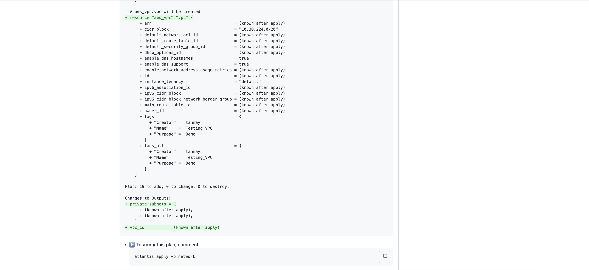

# Open Innovation Assignment

### Problem Statement
You are tasked to implement a platform to support a microservices architecture composed of a backend service, frontend service and PostgreSQL database with the
following requirements
- Automated Deployment
- Fault Tolerant / Highly Available
- Secure
- Autoscaling

### Proposed Solution
- **SCM -**  Github
- **Infrastructure Platform -** 
  - I will used **AWS public cloud** for provisioning all my workloads.
  - AWS works on pay per use
- **Orchestration Platform -** 
  - I will used AWS **EKS Kubernetes** for orchestration.
  - Kubernetes have lots of advantages over other platform such as scalability, scheduling ease, easy administration, self healing, fault tolerent and kubernertes is highly available along with good community support.
- **Containerization Platform -** 
  - I will used **Docker** for containerization.
  - Kubernetes is a  orchestration platform for containers 
- **Infrastructure Automation -**
  - I will use **Terraform** for provisioning infrastructure.
  - Terraform maintain state of infra.
  - Using **Atlantis** for contineous deployment of infrastructure with terraform
- **Automate Deployment of microservices -**
  - I will use **Jenkins** for CI purpose of different microservices. Each service has its own repository.
  - For CD i will use **ArgoCD** application as it provide neat UI and less configuration.
  - Also **Helm chart** for deploying application across env.
- **Monitoring -**
  - **Prometheus stack** for metrics collection.
  - **Newrelic** for logging, synthetic checks, scripted monitors and graph.
  - **Pagerduty** for alerting.
- **Monitoring -**
  - Using **Terratest**

## frontend-backend-database Application Structure
I have created 2 github repository [openinnovationai-frontend](https://github.com/tanmay6414/openinnovationai-frontend) and [openinnovationai-backend](https://github.com/tanmay6414/openinnovationai-backend)
- Used helm chart for application management
- In backend used dependency helm chart for database, as it is tightly couple with backend, we can not deploy single backend pod.
- Each repo has its own [CI process](https://github.com/tanmay6414/openinnovationai-frontend/Jenkinsfile)
- Created third repository [openinnovationai](https://github.com/tanmay6414/openinnovationai) for managing state of application and cluster


# Infrastructure CI/CD Process


## Release process
1. Each Application have its own Github Repository.
2. I prefer to maintain 2 main branched one master and release/*. Master for dev to test and release/* for higher env.
3. Devloper created a Pull request on feature branch.
4. Jenkins CI get trigger.
5. At first Checkout from version control.
6. Adding/updating required helm repo for pulling and pushing helm chart
7. Building application binary.
8. Execute compliance check and Unit test.
9. Once this test passes we I am building my Dockerfile with **ci** tag on it and updating the docker image tag in helm values file. Also update the helm version by merging PR no and build name
10. Package this updated chart and deploy the sample application on kubenrtes.
11. Installed required dependency application
12. Execute integration test on whole application stack.
13. Execute sonar test
14. If everything works update the docker images key in helm chart by <branch-name>-<short-commit-sha> and helm chart by <existing version>-<branch-name>-<short-commit-sha>.
15. Package and published the helm and docker artifact on harbor repository.
16. If branch == master, directly update the QA env  ArgoCD manifest file in openinnovationai repo
17. If branch == release/*, create a PR on release branch on open a pull request on openinnovationai repo with updated version.


### Creating Cluster and its required resources

For creating kubenrtes cluster along with its network and other component, I am using Terraform.
We have different tool as well like Ansible, Cloud formation but each one have its own limitation.
Ansible can not store the state of infrastructure and cloud formation is paid tool by AWS which having limitation to AWS resources.
On other hand Terraform is free tool which supporting storing statefile at different location along with vast community support and have provider for almost each tool which we can consider of in DevOps field.

In this repository [cluster-setup](cluster-setup) directory contain all the Terraform configuration files
Directory structure for **cluster-setup**
```
cluster-setup
├── cluster
│   ├── main.tf
│   ├── provider.tf
│   └── variable.tf
├── dex
├── ingress
├── network
│   ├── main.tf
│   ├── output.tf
│   ├── provider.tf
│   └── variable.tf
├── post-init-cluster
│   ├── main.tf
│   ├── provider.tf
│   └── variable.tf
└── velero
```
You can find more information here [cluster info](ClusterSetup.md)

## Automated Deployment for Cluster
- We are using Terraform for provisioning our cluster, and it consist of different provider and there configuration, so for easy to deploy and consistency we need contineous deployment for or cluster code.
- We have different option like using Jenkins, Tekton but here I am using **Atlantis** for managing CI/CD process for our cluster.
- To use jenkins we need to add lots of configuration and apart from this anyone star
- Atlantis is a tool cdedicatly created for Terraform CI/CD process, and it dont need much configuration ot maintaince.
- It deploy one statefulset in our cluster and using webhook, out github communicated with atlantis.
- It shows Terraform diff on Pull Request and we can create rules for merging of pull request, like all checks need to be pass, atleast one approval from codeowener within atlantis.
- If we  use jenkins we need to add lots of configuration and apart from this anyone can start pipeline with appropriate access, but for atlantis your PR needs to be approved by codeowner for actual deployment.

### Setting up atlantis

- Atlantis is deployed as helm chart in cluster. It has UI which show which PR is ruuning although it is not required to have UI as all diff is rendered on PR, you can disable it.
- Below configuration required for atlantis

```
# Replace this with your own repo whitelist:
orgWhitelist: github.com/tanmay6414/*
orgAllowlist: github.com/tanmay6414/*
# logLevel: "debug"
# If using GitHub, specify like the following:
github:
  user: tanmay6414
  token: <token>
  secret: <secret text for webhook>
image:
  pullPolicy: IfNotPresent
repoConfig: |
  ---
  repos:
  - id: /.*/
    apply_requirements: [approved, mergeable]
    delete_source_branch_on_merge: false
    allowed_overrides: [apply_requirements, workflow, delete_source_branch_on_merge]
    allow_custom_workflows: true

service:
  type: ClusterIP
  port: 80
environment:
  AWS_ACCESS_KEY_ID: <access key>
  AWS_SECRET_ACCESS_KEY: <secret key>
```

- After atlantis started on cluster, for configuring you github repository you need to add [atlantis.yaml](atlantis.yaml). Inside this file you can customize you CD workflow.

### Working
- As mentioned earlier Atlantis render diff on the github PR. You can find this [sample PR](https://github.com/tanmay6414/openinnovationai/pull/1)
- You specifiy different project in your atlantis.yaml file and also planning statergy. If you want auto-plan whenever some one create PR you can mentioned it as below in your atlantis file
```
projects:
- name: network
  dir: .cluster-setup/network/
  autoplan:
    enabled: true
```
- If not you can run a plan by commenting on Github PR with project name 
```
atlantis plan -p network
```

- If Pull request is not approved or plan is not successfull it wont allow you to apply. [Sample](https://github.com/tanmay6414/openinnovationai/pull/2)

- If everything works out then after commenting **atlantis apply -p projectNmae** it will start applying terraform changes and if applied successfully merge the PR as well.
- If apply failed PR will not get merges


## Automated Deployment for Application
- Uses ArgoCD for CD process. Flux dont have any UI and not possible to give access to dev and QA. Tekton need lots of configuration and showing intermidiate issue.

### Installation of ArgoCD
- ArgoCD is installed as Helm chart on kubenrtes cluster.
- have different component like controller, server, notification controller,workflow and repo server.
- Helm values file for confuring argo with EKS
```
crds:
  keep: false
server:
  rbacConfig:
    policy.default: role:readonly
  extraArgs:
   - --insecure
  env:
  - name: AWS_ACCESS_KEY_ID
    value: <access key>
  - name: AWS_SECRET_ACCESS_KEY
    value: <secret-key>
  ingress:
    enabled: true
    hosts:
      - argocd.mycluster.com
    ingressClassName: nginx
  config:
    url: https://argocd.mycluster.com
dex:
  enabled: false

applicationSet:
  extraEnv:
  - name: AWS_ACCESS_KEY_ID
    value: <access key>
  - name: AWS_SECRET_ACCESS_KEY
    value: <secret-key>

controller:
  env:
  - name: AWS_ACCESS_KEY_ID
    value: <access key>
  - name: AWS_SECRET_ACCESS_KEY
    value: <secret-key>
```
- Once Deployed create one ArgoCD [application](argo/cd/app-of-app.yaml) and mentioned the githubrepository folder and apply this manually 
- You also need to configure cluster, helm repo, harbor repo with it, you can find configuration [here](argo/) in this repository.
- Because you created app of app you dont need to apply those file manually, just push changes on master.

### Configuring CD of application
- Write [ArgoCD application](argo/cd/qa/frontend/frontend.yaml) yaml file.
```
apiVersion: argoproj.io/v1alpha1
kind: Application
metadata:
  name: frontend-app-qa
  namespace: argo-cd
spec:
  syncPolicy:
    automated:
      prune: true
  destination:
    name: TestCluster
    namespace: qa
  project: testcluster
  sources:
  -  chart: frontend
     helm:
      releaseName: frontend
      valueFiles:
      - $values/argo/cd/qa/frontend/values.yaml
     repoURL: demo.goharbor.io/openinnovationai
     targetRevision: 0.1.0
  -  repoURL: 'https://github.com/tanmay6414/openinnovationai.git'
     targetRevision: master
     ref: values
```
- **sync** policy define auto sync behaviour
- **destination** define the cluster on which we want to deploy application.
- **sources** define the helm repo and github repo for helm chart and values file.
- We can provide access for dev and qa as per there requirnment, they can take ownership of there app.


## Setup Monitoring and alerting on application
- I used prometheus stack for alerting and monitoring purpose
- Prometheus collect metrics thjroughout the cluster with help of its exporter.
- I have define a [PrometheusRule](cluster-setup/monitoring/rule.yaml) bases on out requirnment and can confiugure prometheus to send alert to alertmanagert.
- I have configured configure alert manager to send notification on different channel like slack, email pagerduty.
- Also Newrelic and pingdom to have synthetic check on out application URL and Newrelic scripted browser to ensure out application is up and running
- Finally we make use of Newrelic dashboard and grafana dashboard for data visualization
- We can use newrelic logs for observability purpose.
- We can also create a a on call schedule in pagerduty and route this alert to pagerduty, so that on call person get to know about any outages.

### Install Prometheus Stack
- Prometheus stack is installed as helm chart
- It include prometheus controller, alermanager controller, grafana, and thanos.
- **Helm values file for prometheus setup**
```
prometheus:
  ingress:
    enabled: true
    ingressClassName: nginx
    annotations: 
      kubernetes.io/ingress.class: nginx
    hosts:
    - metrics.mycluster.com
  prometheusSpec:
    externalUrl: "https://metrics.mycluster.com"
    alerting:
      alertmanagers:
        - namespace: monitoring
          name: alertmanager-main
          port: web
```
- **Helm values for alertmanager with sample receiver**
```
alertmanager:
  ingress:
    enabled: true
    ingressClassName: nginx
    annotations: 
      kubernetes.io/ingress.class: nginx
    hosts:
      - alerts.mycluster.com
  alertmanagerSpec: 
    externalUrl: "https://alerts.mycluster.com"
    config:
      global:
        slack_api_url: ""
        resolve_timeout: 5m
      route:
        receiver: "slack-receiver"
        group_by: ["alertname"]
        group_wait: 30s
        group_interval: 1m
        repeat_interval: 5m
        routes:
        - match:
          severity: critical
      receivers:
        - name: "slack-receiver"
          slack_configs:
            - api_url: ""
              channel: "#testchannel"
              send_resolved: true
              title: "[{{ .Status }}] {{ .GroupLabels.alertname }} {{ .CommonLabels.severity }}"
              text: "{{ .Annotations.summary }}\n{{ .Annotations.description }}"
```
- Apply default prometheus rule for kubenrtes (easily available on google)
- [Sample Rule](/cluster-setup/monitoring/rule.yaml)
- After intentinally draining a node we got below notification on slack.
