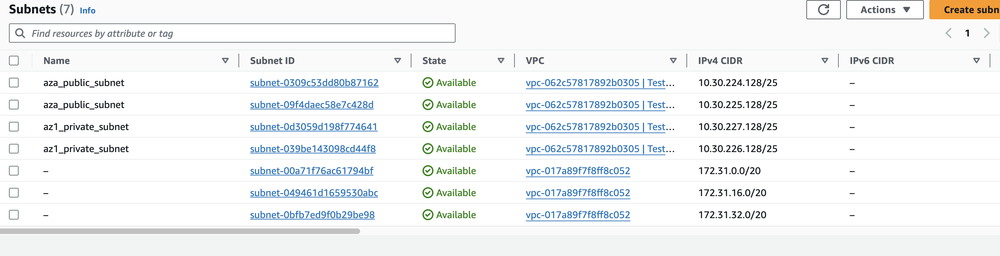
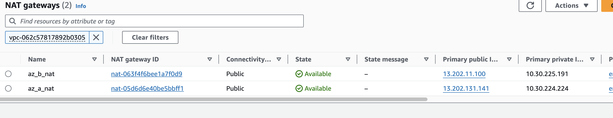
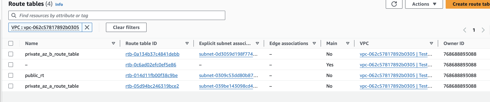
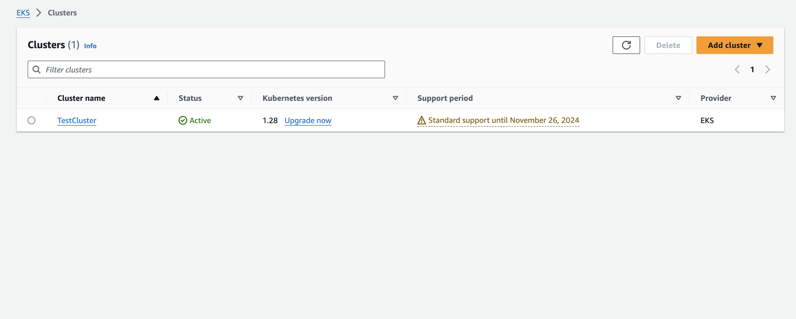
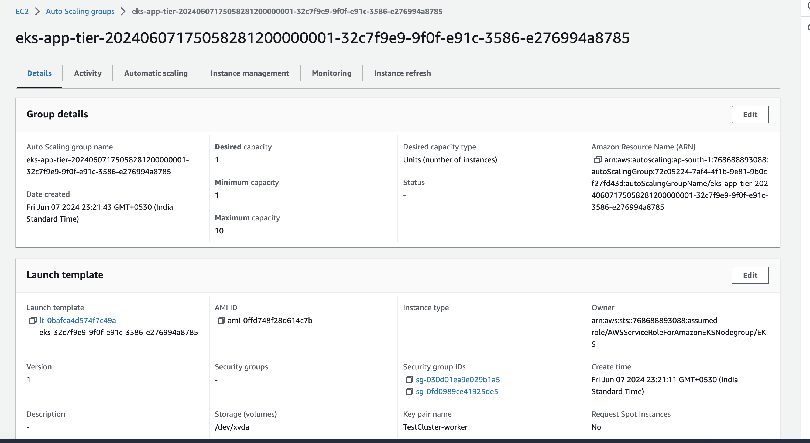
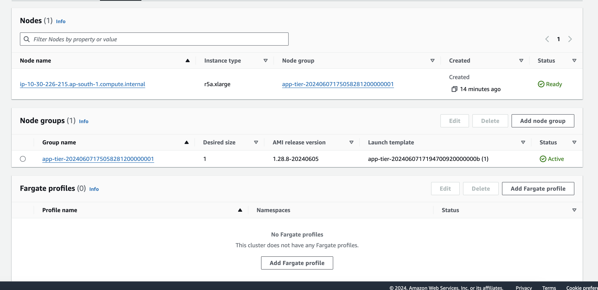
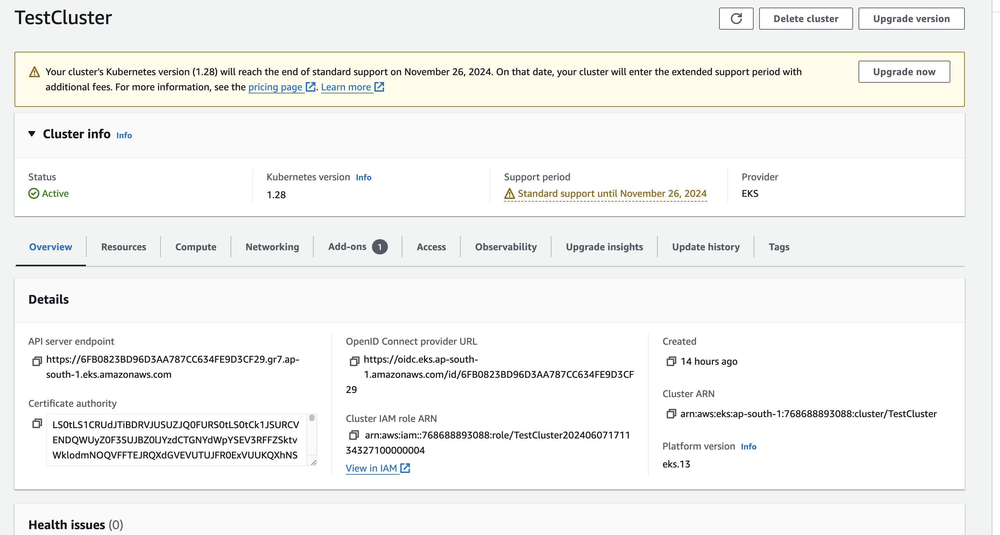
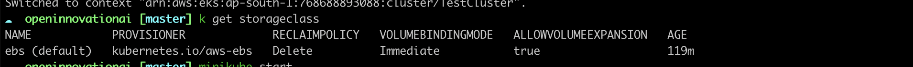
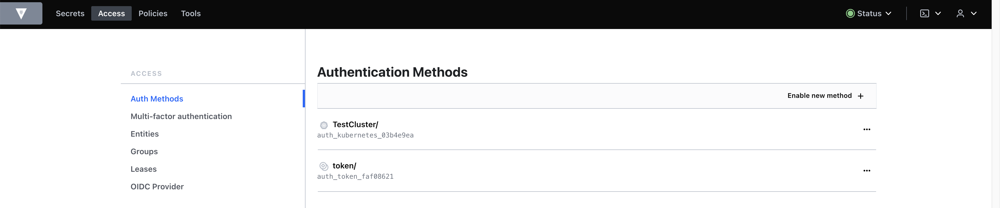

# Open Innovation Assignment

### Problem Statement
You are tasked to implement a platform to support a microservices architecture composed of a backend service, frontend service and PostgreSQL database with the
following requirements
• Automated Deployment
• Fault Tolerant / Highly Available
• Secure
• Autoscaling

### Proposed Solution

- I am using Docker package and manage above application as it consistent and isolated environment deployment across different application.
- For orchestring docker container I am using Kubernetes. We have option like docker-sworm and other but kubenrtes have lots of advantages over such platform such as scalability, scheduling ease, easy administration, self healing, fault tolerent and kubenrtes is highly available along with good community support.
- I am using AWS public cloud for hosting all those component.
- For this solution, i am deploying Kubernetes cluster using EKS with managed node group. 
>EKS is managed Kubernetes service provided by AWS which provide high availability (3 master), Enhance security, easy upgrade statergy.
So that we can focus on system reliability rather than spending lots of time on administration.

### Creating Cluster and its required resources

For creating kubenrtes cluster along with its network and other component, I am using Terraform.
We have different tool as well like Ansible, Cloud formation but each one have its own limitation.
Ansible can not store the state of infrastructure and cloud formation is paid tool by AWS which having limitation to AWS resources.
On other hand Terraform is free tool which supporting storing statefile at different location along with vast community support and have provider for almost each tool which we can consider of in DevOps field.

In this repository [cluster-setuo](cluster-setup) directory contain all the Terraform configuration files
Directory structure for **cluster-setup**
```
cluster-setup
├── cluster
│   ├── main.tf
│   ├── provider.tf
│   └── variable.tf
├── dex
├── ingress
├── network
│   ├── main.tf
│   ├── output.tf
│   ├── provider.tf
│   └── variable.tf
├── post-init-cluster
│   ├── main.tf
│   ├── provider.tf
│   └── variable.tf
└── velero
```

### Network
- Cluster folder contains configuration file related to VPC, subnet, routing and different component of network.
- it consist of 2 availability zone for **high availability** so even if one az goes down we have compute power to schedule out application in another az. 

- Also all the worker nodes are in pivate subnet so that **they can not be publically accessible**, and for internet connection in private subnet I am using NAT Gateway which is managed NAT instance by AWS.


- For creating network, I am using **Terraform AWS provider**

### Cluster
- Cluster consist of EKS cluster along with its component like Node group, storage volume (EBS) autoscaling group, launch template and some security groups and IAM role.

- Autoscaling group **fault toleration** to our cluster, it spin up instances immidiatly if our current instance/s is mark unhealthly in EC2. We have *min, max and desire* confuguration for managing those instances.


- We can also use spot node along with on demand node to manage cost in out infrastructure as spot node is ~70% cheaper than on demand
- Security group manages in out access to our network and some IAM roles with policies are also get created for nodes to access aws resources like autoscaling.


#### post-init-cluster
- Additinal component like storage class, cluster autoscaler, vault authentication mechanism installing different operators include in post init.
- All those tool help us to manage workload in our cluster.

- In out module we have storageclass to dynamically creats volume for us, cluster-autoscaler to increase resources in cluster if we are exhausingexisying one to provide availability and fault-tolerence.
- I also nclude Hashicorp vault configuration to manage secrets throughout the ci/cd pipeline. It is also useful for providing temporory access to DB and AWS env.


#### auth security
- This module consist of dex and login ingress setup.
- If you have Activve Directory or any other authenticating service mechanisms you can install dex to provide group bases access control to user.
- Lets say you have group k8s:Dev in AD and you want to provide them only read only access then you can achieve this by dex configuration.
- Dex along with login url gives you ability to provide short term access to kubenrtes
- This is a secure way for providing access to kubenrtes cluster
- Below configuration provide access only for 24h. It uses dex authenticator for authentication.
```
config:
  connectors:
  - config:
      clientID: <client id>
      clientSecret: <client secret>
      redirectURI: <redirect url>
      tenant: <tenant id>
    id: microsoft
    name: Microsoft
    type: microsoft
  expiry:
    idTokens: 24h
    signingKeys: 6h
  frontend:
    issuer: Vignet
    issuerUrl: <issuer URL>
    theme: coreos
  issuer: <issuer url>
```

### Velero
- Velero is used for backup purpose, so even if accidently you delete your env you will have backup to restore it.
- It has different pluging for different clouds provider to backup external resources like RDS and EBS.
- You have to mentioned backup location to keep your backup.
- You also can create backup schedule which help to periodically created backup as per your requirnment.
```
configuration:
  backupStorageLocation:
  - bucket: openinnovation-velero-backups
    config:
      region: ap-south-1
    name: aws
    prefix: openinnovation-velero-backups
    provider: aws
```
- We can also specify ttl with backup

#### Ingress
- Ingress module is required to configure the URL's of your application.
- We have different other way to expose out app as well like LoadBalancer service but then we have to create load balancer for each url resulting increase cost.
- It create one loadbalancer service in your aws env
```
☁  openinnovationai [master] ⚡  k get svc -n ingress|
Warning: short name "svc" could also match lower priority resource services.tap.linkerd.io
nginx-ingress-ingress-nginx-controller                  LoadBalancer   172.20.192.94    a733965d042b14903bfd651ec71d888d-1619646725.us-east-1.elb.amazonaws.com   80:31364/TCP,443:30619/TCP
```

#### Monitoring
Monitoring module consist of prometheus, grafana, alertmanager, thanos, newrelic setup.
Prometheus help us to collect etrics within out cluster and even if our app is not supporting prometheus metrics we can use exporter to send prometheus redable data from application.
Grafana useful for creating dahboard, which make it easy to understand current state of cluster
Alertmanager is used to notify users through different channels when something goes wrong in the cluster.
